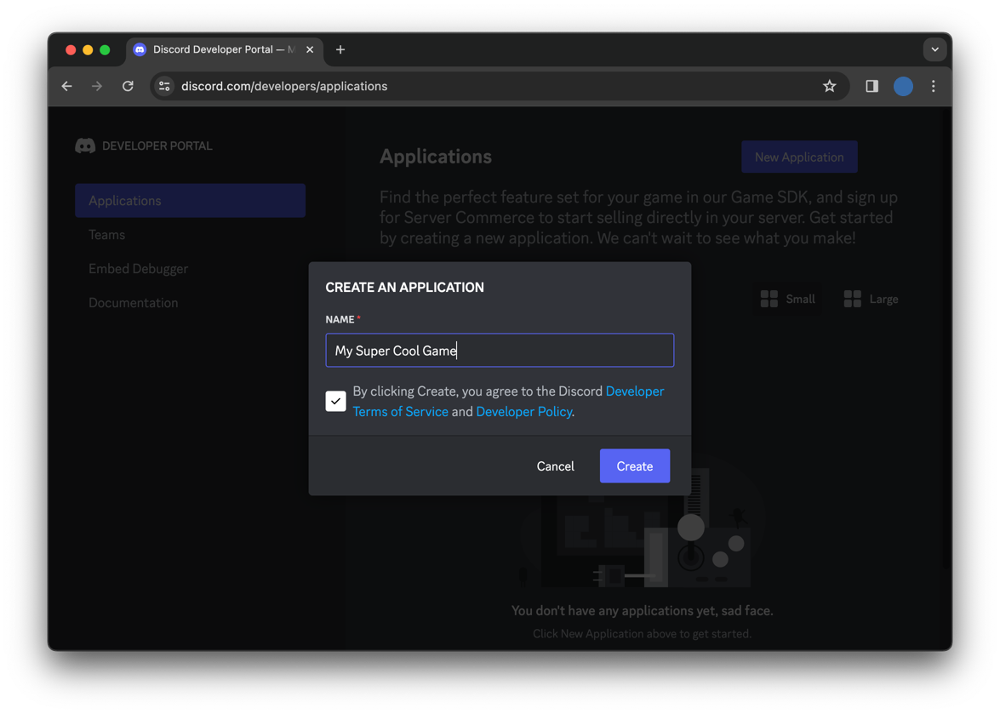
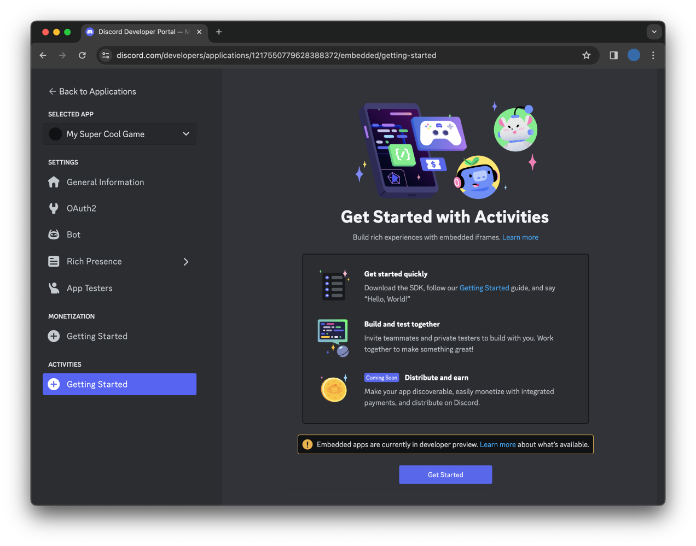
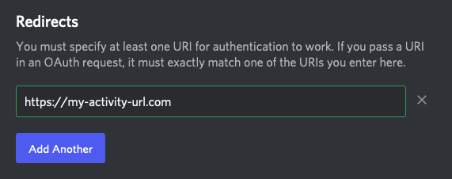
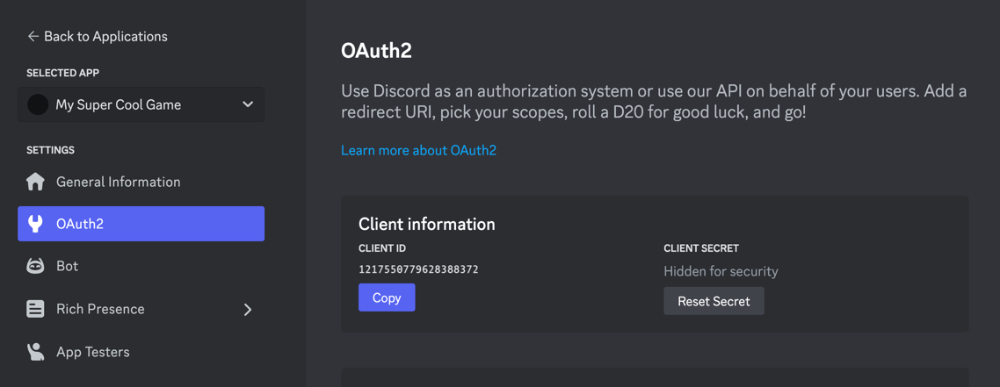
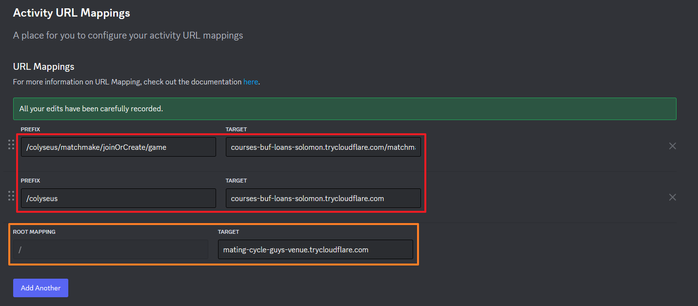
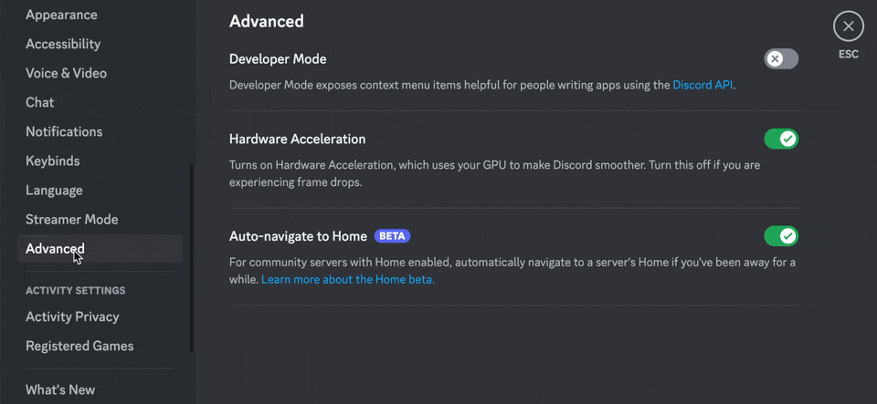
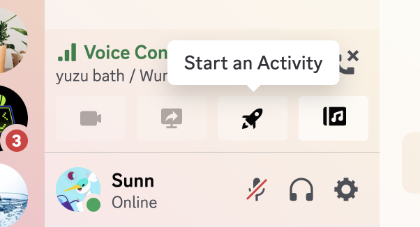

# Discord Activity: Getting Started Guide

This template is used in the [Building An Activity](https://discord.com/developers/activities/building-an-activity) tutorial in the Discord Developer Docs.

Read more about building Discord Activities with the Embedded App SDK at [https://discord.com/developers/docs/activities/overview](https://discord.com/developers/docs/activities/overview).

## How to build project

[Official document reference](https://discord.com/developers/docs/activities/building-an-activity#step-1-creating-a-new-app)

1. [Create Disocrd Application](#create-discord-application)
2. [Set Discord application OAuth in project](#set-oauth-info-in-project)
3. [Install npm](#install-nvm)
4. [Run client side app](#run-client-side-app)
5. [Run server side app](#run-server-side-app)
6. [Run Activity in Discord](#run-activity-in-discord)

### Create Discord Application

1. Create application on [Discord Developer Portal](https://discord.com/developers/applications)

    

2. Configure Activities

    

3. Set OAuth2 redirect URI

    * You should point to the address where you host the activity app.
    * For local test, you can set `https://127.0.0.1`.

    

### Set OAuth info in project

1. Get your Applicaition cliend id and client secret

    * Cliet `Reset Secret` to get secret. This secret key would be hidden forever after you closing the site.

    

2. Create `.env` file

    * `cp example.env .env`

3. Modify the value in `.env` file

  ```shell
  VITE_DISCORD_CLIENT_ID=YOUR_OAUTH2_CLIENT_ID_HERE
  DISCORD_CLIENT_SECRET=YOUR_OAUTH2_CLIENT_SECRET_HERE
  ```

### Install nvm

* Windows
  * Windows user can directly download and install Node.js. [Link](https://nodejs.org/en/download)
  * Windows user can also install `nvm`. [Link](https://github.com/coreybutler/nvm-windows/releases)

* Linux
  * Linux user recommands install nvm by command.
  * The `nvm` is a convenient tool to manage and switch Node.js version.

  ```shell
  # installs NVM (Node Version Manager)
  curl -o- https://raw.githubusercontent.com/nvm-sh/nvm/v0.39.7/install.sh | bash

  # may need to restart terminam after install nvm or it can not find nvm
  # download and install Node.js
  nvm install 20

  # verifies the right Node.js version is in the environment
  node -v # should print `v20.11.1`

  # verifies the right NPM version is in the environment
  npm -v # should print `10.2.4`
  ```

### Install pnpm

* According to Dicord official examples, we choose `pnpm` instead of `npm`.
* You can also install pnpm by npm. [pnpm official link](https://pnpm.io/installation)

* Windows
  * Install by Powershell

  ```shell
  iwr https://get.pnpm.io/install.ps1 -useb | iex
  ```

* Linux
  * Install by curl

  ```shell
  curl -fsSL https://get.pnpm.io/install.sh | sh -
  ```

### Run app

* You can run both client and server side or run them individualy.

#### Install necessary packages

* Only need do once.

```shell
# install packages in root folder
pnpm install

# install pacakges needed by client app
# If it can find discord-sdk version when installing, you can use `yarn` to choose the version of discord-sdk to install.
cd packages/client
pnpm install

# install pacakges needed by server app
# If it can find discord-sdk version when installing, you can use `yarn` to choose the version of discord-sdk to install.
cd packages/server
pnpm install
```

#### Prepare environment

1. Make sure can access your app by port `3000` and `13001` on Internet
    * Some recommend methods
        * Have a domain name can be accessed
        * Use Cloudflared to create a network tunnel [Tutorial](https://medium.com/@zetavg/%E4%BD%BF%E7%94%A8-cloudflare-tunnel-%E4%BD%9C%E7%82%BA%E4%BD%8E%E6%88%90%E6%9C%AC%E7%9A%84-ngrok-%E6%9B%BF%E4%BB%A3%E5%93%81-6b0aaef97557)
            * Client app entrypoint: `cloudflared tunnel --url http://localhost:3000`
            * Server app entrypoint: `cloudflared tunnel --url http://localhost:13001`

2. Set URL mappings
    * Set `root mapping` as `/` like the orange box. It is used to connect the Discord OAuth2 service (port:3001).
    * Set `colyseus mapping` as `/colyseus` and `/colyseus/matchmake/joinOrCreate/game` link in the red box. It is used to connect the colyseus service in server app from client app.
    * Because there is a strict CSP limitation when client app run on Discord Activity. You can not directly connect like `https://localhost:13001`. You can only connect `https://{CLIENT_ID}.discordsays.com`. Therefore, we need to add the url mapping to server app.

    

3. Enable Discord Developer Mode
    * Go to your User Settings -> Advanced and toggle on the Developer Mode setting
    * You need to enable it or you can not find the application in activites the Rocket icon 🚀

    

#### Run both client & server app

```shell
npm dev
# Output
#  packages/client dev:   vite v2.9.18 dev server running at:
#  packages/client dev:   > Local: http://localhost:3000/
#  packages/server dev: App is listening on ws://localhost:13001
```

#### Run client app

```shell
npm dev
```

#### Run server app

```shell
npm dev
```

### Run Activity in Discord

* Click Rocket icon and select the app you created

    
