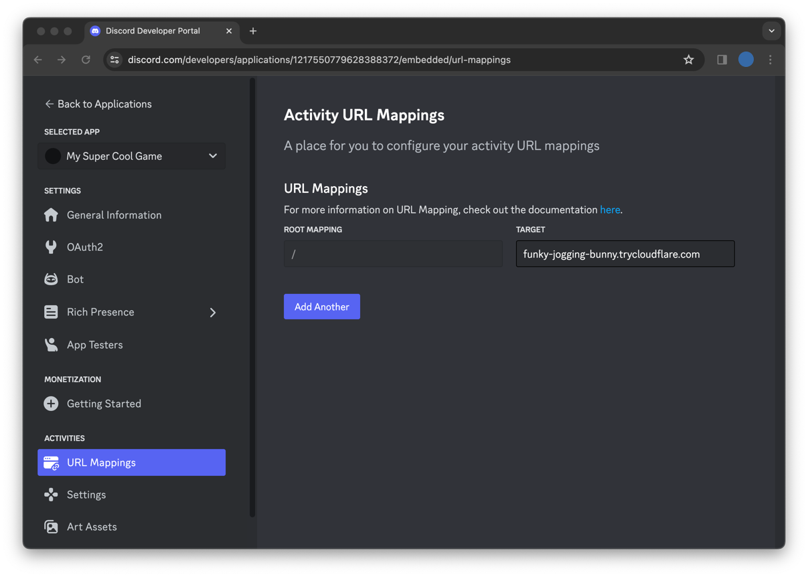

# Discord Activity: Getting Started Guide

This template is used in the [Building An Activity](https://discord.com/developers/activities/building-an-activity) tutorial in the Discord Developer Docs.

Read more about building Discord Activities with the Embedded App SDK at [https://discord.com/developers/docs/activities/overview](https://discord.com/developers/docs/activities/overview).

## How to build project

[Official document reference](https://discord.com/developers/docs/activities/building-an-activity#step-1-creating-a-new-app)

1. [Create Disocrd Application](#create-discord-application)
2. [Set Discord application OAuth in project](#set-oauth-info-in-project)
3. [Install npm](#install-nvm)
4. [Run client side app](#run-client-side-app)
5. [Run server side app](#run-server-side-app)
6. [Run Activity in Discord](#run-activity-in-discord)

### Create Discord Application

1. Create application on [Discord Developer Portal](https://discord.com/developers/applications)

    

2. Configure Activities

    

3. Set OAuth2 redirect URI

    * You should point to the address where you host the activity app.
    * For local test, you can set `https://127.0.0.1`.

    

### Set OAuth info in project

1. Get your Applicaition cliend id and client secret

    * Cliet `Reset Secret` to get secret. This secret key would be hidden forever after you closing the site.

    

2. Create `.env` file

    * `cp example.env .env`

3. Modify the value in `.env` file

  ```shell
  VITE_DISCORD_CLIENT_ID=YOUR_OAUTH2_CLIENT_ID_HERE
  DISCORD_CLIENT_SECRET=YOUR_OAUTH2_CLIENT_SECRET_HERE
  ```

### Install nvm

* Windows
  * Windows user can directly download and install Node.js. [Link](https://nodejs.org/en/download)
  * Windows user can also install `nvm`. [Link](https://github.com/coreybutler/nvm-windows/releases)

* Linux
  * Linux user recommands install nvm by command.
  * The `nvm` is a convenient tool to manage and switch Node.js version.

  ```shell
  # installs NVM (Node Version Manager)
  curl -o- https://raw.githubusercontent.com/nvm-sh/nvm/v0.39.7/install.sh | bash

  # may need to restart terminam after install nvm or it can not find nvm
  # download and install Node.js
  nvm install 20

  # verifies the right Node.js version is in the environment
  node -v # should print `v20.11.1`

  # verifies the right NPM version is in the environment
  npm -v # should print `10.2.4`
  ```

### Run client side app

1. Follow below command to launch app

    ```shell
    cd client

    # install needed packages
    npm install

    # install discord SDK if it does not be auto installed by above command
    npm install @discord/embedded-app-sdk

    # launch client app
    npm run dev

    # Output
    #  ➜  Local:   http://localhost:5173/
    #  ➜  Network: use --host to expose
    #  ➜  press h + enter to show help
    ```

2. Make sure can access your app by port 5173 on Internet
    * Some recommend methods
        * Have a domain name can be accessed
        * Use Cloudflared to create a network tunnel [Tutorial](https://medium.com/@zetavg/%E4%BD%BF%E7%94%A8-cloudflare-tunnel-%E4%BD%9C%E7%82%BA%E4%BD%8E%E6%88%90%E6%9C%AC%E7%9A%84-ngrok-%E6%9B%BF%E4%BB%A3%E5%93%81-6b0aaef97557)
            * `cloudflared tunnel --url http://localhost:5173`

3. Set URL mappings
    * Set `root mapping` as `/`
    * Set `target` as the access address in step 2.

    

4. Enable Discord Developer Mode
    * Go to your User Settings -> Advanced and toggle on the Developer Mode setting
    * You need to enable it or you can not find the application in activites the Rocket icon 🚀

    

### Run server side app

1. Follow below command to launch app

    ```shell
    cd server

    # install needed packages
    npm install

    # launch client app
    npm run dev

    # Output
    #  Server listening at http://localhost:3001
    ```

### Run Activity in Discord

* Click Rocket icon and select the app you created

    
